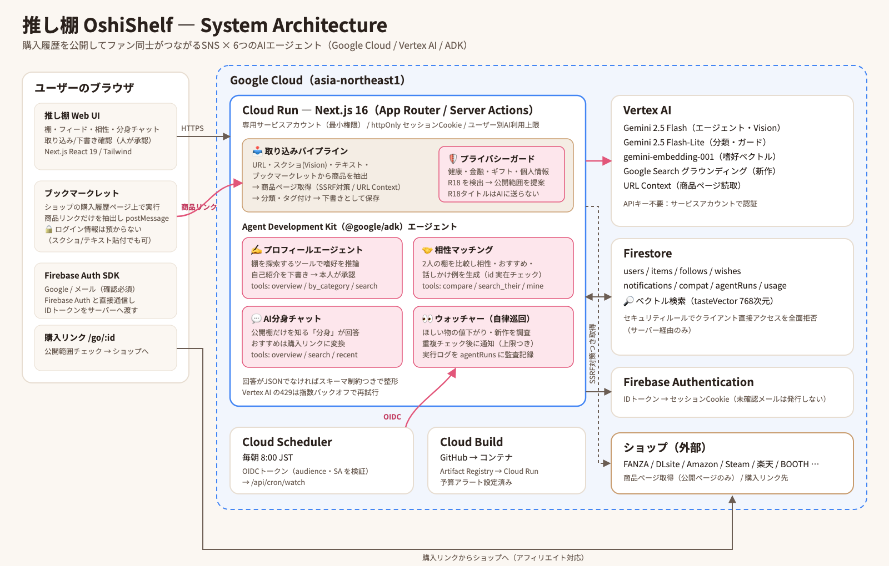
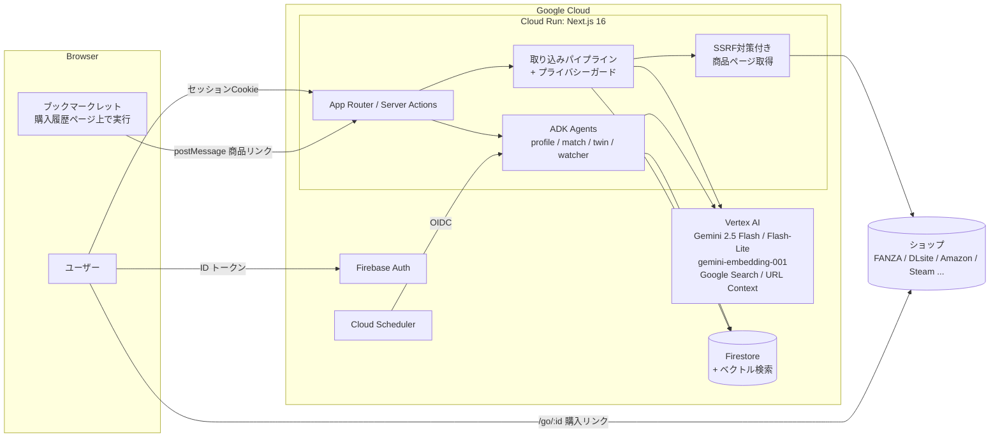

# 推し棚 (OshiShelf)

**買ったものが、あなたの自己紹介になる。**

FANZA・DLsite・Amazon・Steam など、どこで買った作品も「棚」に並べて公開し、同じ趣味のファン同士がつながる SNS です。
フォロワーの棚から気になる作品を見つけたら、そのまま商品ページへジャンプして購入できます。
6 つの AI エージェントが、購入履歴の取り込みから公開前のプライバシーチェック、趣味の合う人探しまでを自律的に支援します。

第5回 Agentic AI Hackathon with Google Cloud 応募作品。

- デプロイ URL: https://oshi-dana.com
- ログイン: Google アカウント、またはメールアドレス
- 審査用アカウント: ログイン画面の「デモアカウントでログイン」ボタン（`demo@oshishelf.app` / `oshishelf-demo-2026`）

## 解決したい課題

- 「何を買ったか」はその人の趣味を最も正直に表すが、購入履歴はショップごとに閉じていて、ファン同士で見せ合えない。
- 手で棚を作るのは面倒で、しかも購入履歴には「人に見られたくない物」が混ざる。
- SNS で趣味の合う人を探すのは大変で、見つけても最初の一言が難しい。

## AI エージェント

| エージェント | 役割 | 実装 |
|---|---|---|
| 📥 取り込みエージェント | 購入履歴ページ（ブックマークレット）・スクショ・URL・ページテキストから商品を抽出し、商品ページを解析・分類・タグ付けして下書き化 | Gemini マルチモーダル + 構造化出力、URL Context フォールバック |
| 🛡️ プライバシーガード | 公開前に「健康・金融・ギフト・個人情報・R18」など見られたくない可能性のある商品を検出し、公開範囲を提案。人間が確認してから公開 | Gemini 構造化出力（R18 ショップの作品はタイトルを AI に送らず決定的に判定） |
| ✍️ プロフィールエージェント | 棚をツールで探索して嗜好を推論し、自己紹介文を下書き。本人が編集・承認して公開 | ADK `LlmAgent` + FunctionTool |
| 🤝 相性マッチング | 嗜好ベクトルで近い人を推薦。プロフィールでは 2 人の棚を比較し、相性・共通点・おすすめ作品・話しかけ例を生成 | `gemini-embedding-001` + Firestore ベクトル検索、ADK エージェント |
| 💬 AI 分身チャット | フォロー相手の公開棚だけを知る「分身」に、おすすめを聞ける。回答中の作品は購入リンクになる | ADK エージェント（棚検索ツール） |
| 👀 ウォッチャー | 毎朝自律巡回し、「ほしい」商品の値下がりと、好きなジャンル・作家の新作（Google 検索グラウンディング）を通知 | ADK エージェント + Cloud Scheduler（OIDC） |

各エージェントのツール呼び出しは UI 上に「エージェントの行動ログ」として表示され、ウォッチャーの実行は Firestore の `agentRuns` に監査ログとして残ります。

## アーキテクチャ



<details>
<summary>Mermaid 版</summary>



</details>

## セキュリティ・制御

- **ログイン情報を預からない**: ログイン必須の購入履歴ページは、ユーザー自身のブラウザ上でブックマークレットが読み取り、商品リンクだけを推し棚へ渡す。
- **人間が最終判断**: 取り込んだ商品は必ず下書きになり、プライバシーガードが要確認とした物は選択が外れた状態で提示される。AI が書いた自己紹介も承認制。
- **R18 は閲覧者が選ぶ**: 持ち主は R18 作品も全体公開にできるが、閲覧者には初期状態で表示されない。18 歳以上と申告して表示を ON にした人だけが見られ（フィード・棚・購入リンクのすべてで判定）、OFF の人はフォローした人の棚でも非 R18 の作品だけを見られる。R18 作品のタイトルは LLM に送らず、AI の出力（自己紹介・分身・マッチング）は全体公開かつ非 R18 の作品だけを根拠にする。
- **SSRF 対策**: 商品ページ取得は http(s) のみ、DNS 解決後のプライベート IP を拒否し、リダイレクトを 1 ホップごとに再検証、サイズと時間を制限。
- **エージェントの権限制限**: ツールは読み取り中心で、通知・検索には 1 回の実行あたりの上限がある。モデルが返した item id は実在チェックしてから使う。
- **コスト・乱用対策**: ユーザー × 機能ごとの 1 日あたり AI 利用上限。Vertex AI の 429 は指数バックオフで再試行。
- **認証**: Firebase Auth の ID トークンを httpOnly セッション Cookie に交換。Firestore はクライアントからの直接アクセスをルールで全面拒否し、サーバー（最小権限のサービスアカウント）経由のみ。cron エンドポイントは Cloud Scheduler の OIDC トークン（audience・サービスアカウント）を検証。

## 提出資料

- [Zenn 記事の下書き](docs/zenn-article.md)
- [デモ動画の台本](docs/demo-video-script.md)
- [提出チェックリストとプロジェクト説明文](docs/submission.md)

## 技術スタック

Next.js 16 (App Router, Server Actions) / TypeScript / Tailwind CSS v4 / Agent Development Kit (`@google/adk`) / Google Gen AI SDK / Vertex AI (Gemini) / Firestore（ベクトル検索）/ Firebase Authentication / Cloud Run / Cloud Scheduler / Cloud Build

## ローカル開発

```bash
pnpm install
cp .env.example .env.local        # GOOGLE_CLOUD_PROJECT などを設定
gcloud auth application-default login
pnpm dev
```

- Firestore のインデックスとルール: `scripts/setup-firestore.sh`
- デモデータ投入: `BOOKS_API_KEY=... node scripts/seed.mts`

## デプロイ

本番は Cloud Run のドメインマッピングで `oshi-dana.com`（と `www`）を割り当てています。DNS は Cloudflare（レジストラ）で、プロキシを使わず Cloud Run 指定の A / AAAA / CNAME を登録しています。`www` と `*.run.app` へのアクセスは `src/proxy.ts` で `APP_ORIGIN` に 301 転送します（`/api` を除く）。

```bash
gcloud run deploy oshishelf --source . --region=asia-northeast1 \
  --service-account=oshishelf-run@<PROJECT>.iam.gserviceaccount.com --allow-unauthenticated \
  --set-env-vars=GOOGLE_CLOUD_PROJECT=<PROJECT>,APP_ORIGIN=https://oshi-dana.com,CRON_AUDIENCE=<RUN_APP_URL>/api/cron/watch,SCHEDULER_SA_EMAIL=oshishelf-scheduler@<PROJECT>.iam.gserviceaccount.com
```
